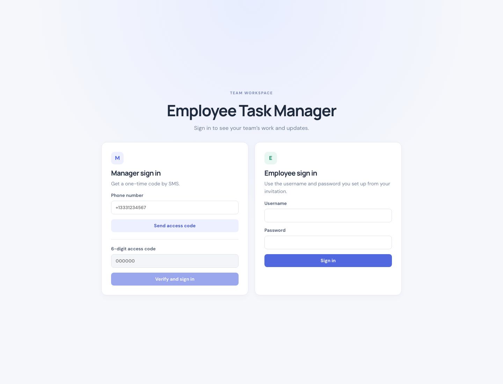
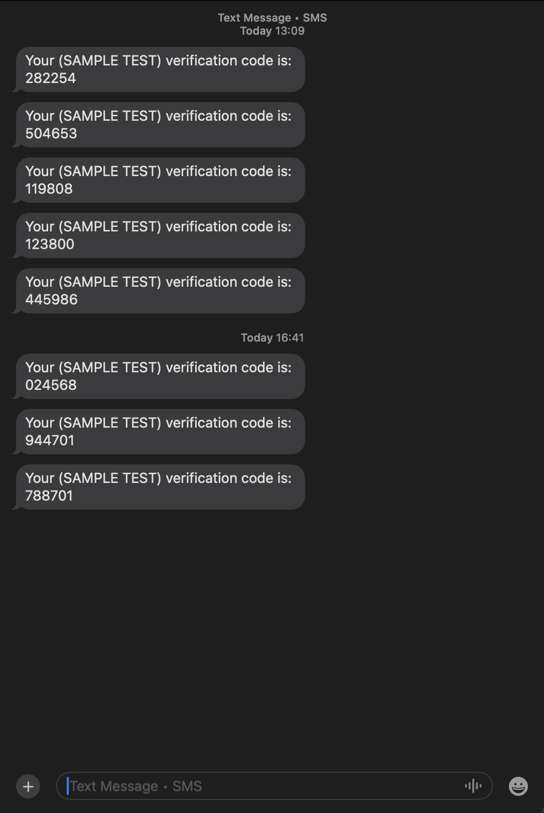

# Employee Task Manager

A real-time task management app for a manager and employees. The React/Vite client talks to an Express API. Firebase Realtime Database stores the records, Twilio Verify sends and checks manager SMS codes, and Socket.IO delivers live task and chat updates.

## Screenshots

The login screenshot is included. Save the remaining screenshots in `docs/screenshots/` using the filenames shown below; the README image references are ready for them.

### Login



### Manager verification code

Save a screenshot showing the manager code-entry step as `docs/screenshots/manager-verify-code.png`.



### Manager dashboard

Save a screenshot of the manager task dashboard as `docs/screenshots/manager-dashboard.png`.


### Employee dashboard

Save a screenshot of the employee task dashboard as `docs/screenshots/employee-dashboard.png`.


### Employee invitation email

Save a screenshot of the employee setup invitation email as `docs/screenshots/employee-invitation-email.png`.


### Firebase employee records

Save a screenshot of the employee records in Firebase Realtime Database as `docs/screenshots/firebase-employees.png`.


## What the app does

### Manager

1. Enters the owner phone number and requests an SMS code.
2. Enters the newest code. Twilio verifies it, then Express issues a one-hour JWT session in an `HttpOnly` cookie.
3. Adds employees by name, email, department, and optional phone number. The employee profile is saved in Firebase and the employee receives a one-time account setup link by email.
4. Assigns and updates tasks, edits employee profiles and schedules, removes employees, and chats with employees.

### Employee

1. Opens the invitation email and creates a username and password.
2. Signs in with those credentials. The password is stored as a bcrypt hash.
3. Views assigned tasks, marks tasks done, edits contact details, and chats with the manager.

Employees can be assigned tasks before they finish account setup. Those tasks appear after the employee activates their account.

## How it is built

- `client/`: React UI, Vite dev server, and Socket.IO client.
- `server/`: Express API, JWT cookie sessions, Nodemailer SMTP invitations, and Socket.IO server.
- `server/firebase.js`: Firebase Admin SDK connection to Realtime Database.
- Firebase records are stored at `owners/owner_001`, `employees/{employeeId}`, `tasks/{taskId}`, and `chats/{employeeId}/{messageId}`.
- Server routes check the signed-in user and role before reading or changing protected records. Employee setup links are random, expire after 24 hours, and are stored as hashes. Passwords are hashed; SMS codes are handled by Twilio Verify and aren’t stored in Firebase.

## Run locally

Install [Node.js](https://nodejs.org/) 20.12 or newer. The manager record and Firebase service account must be configured before the server can start.

### 1. Configure Firebase

- Put the Firebase Admin service account JSON at `server/service-account.json`. This private key file is ignored by Git; never commit it.
- Confirm `server/firebase.js` points to the intended Realtime Database URL.
- Create the manager record in Realtime Database at `owners/owner_001`, with `role: "owner"` and `phoneNum` in E.164 format, for example `+13312407821`.

### 2. Configure environment variables

Copy `server/.env.example` to `server/.env`, then fill in real values:

- `TWILIO_ACCOUNT_SID`, `TWILIO_AUTH_TOKEN`, and `TWILIO_VERIFY_SERVICE_SID` for Twilio Verify.
- `JWT_SECRET`: generate a private random value with `node -e "console.log(require('node:crypto').randomBytes(32).toString('hex'))"`.
- `SMTP_HOST`, `SMTP_PORT`, `SMTP_USER`, `SMTP_PASS`, and `SMTP_FROM` for the sender account used for employee invitations.
- `APP_BASE_URL=http://localhost:5173` for local development.

For Gmail, use `smtp.gmail.com`, port `587`, your full Gmail address as `SMTP_USER`, and a Google App Password as `SMTP_PASS`. Do not use your regular Google password. Never commit `server/.env` or share its values. Each machine needs its own configuration and Firebase service account; `.env.example` contains placeholders only.

### 3. Start the backend

In a terminal:

```bash
cd server
npm install
npm run dev
```

The backend should print `Server running at http://localhost:3000`.

### 4. Start the frontend

In a second terminal:

```bash
cd client
npm install
npm run dev
```

Open the Vite URL shown in the terminal, usually `http://localhost:5173`. Vite forwards `/api` and `/socket.io` requests to the backend. `localhost` is only available on the computer running the app; internet access requires deployment and hosted environment variables.

## Main API routes

- Manager SMS: `POST /api/owner/CreateNewAccessCode`, `POST /api/owner/ValidateAccessCode`.
- Employee account: `POST /api/auth/employee-setup`, `POST /api/auth/employee-login`.
- Employees: `GET/POST /api/employees`, `GET/PATCH/DELETE /api/employees/:employeeId`.
- Tasks: `GET/POST /api/tasks`, `PATCH/DELETE /api/tasks/:taskId`.
- Chat history and messages: `GET/POST /api/chats/:employeeId/messages`.
- Current session and logout: `GET /api/me`, `POST /api/logout`.

The required manager `POST` endpoints `CreateEmployee`, `GetEmployee`, and `DeleteEmployee` are also available under `/api/owner/`.

## Before deployment

Use HTTPS and set the private environment variables in the hosting provider rather than in source control. Set `NODE_ENV=production` and `APP_BASE_URL` to the deployed app URL. Route `/api` and `/socket.io` to Express. The current rate limits are in memory and suit local/single-instance use; use shared storage for rate limits when running multiple backend instances.
